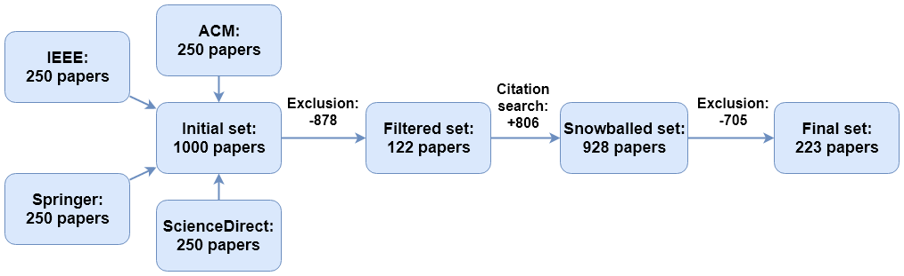

# Maintainability Assurance for SOA and Microservices: A Systematic Literature Review

> This repository contains all artifacts related to an SLR about maintainability assurance for SOA and microservices (223 primary studies, 2007-2018)

## Research Questions

- **RQ1:** How can maintainability assurance research proposed for service- and microservice-based systems be categorized?
- **RQ2:** How are the identified publications distributed among the formed categories?
- **RQ3:** What are the most relevant research directions per identified category?
- **RQ4:** What are notable differences between the approaches proposed for service-based systems and those for microservices?

## Results per Stage

## List of Artifacts

- Research protocol: [slr-protocol.md](slr-protocol.md)
- Research categorization taxonomy: [slr-categorization.md](slr-categorization.md)
- Final set of primary studies: [excel file](slr-primary-studies.xlsx), [markdown table](slr-primary-studies.md), [bib file](slr-primary-studies.bib)
- Aggregated distribution diagrams: [slr-results-diagrams.xlsx](slr-results-diagrams.xlsx)
- History of each SLR process step: [history](history)