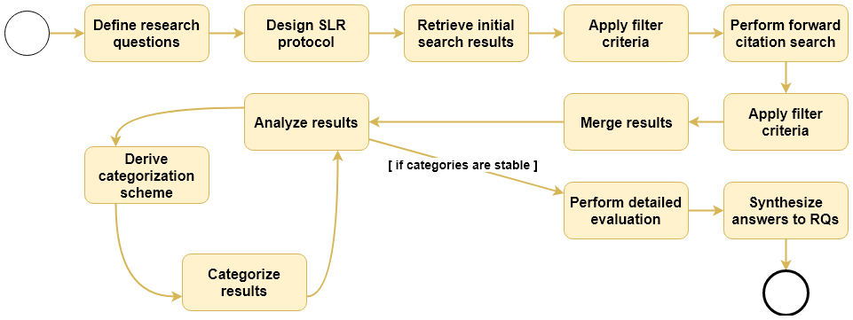

# SLR Protocol

> This document describes the detailed protocol we adhered to during the SLR.

## Research Process

## Electronic Data Sources

- IEEE Xplore: https://ieeexplore.ieee.org
- ACM Digital Library: https://dl.acm.org
- Springer Link: https://link.springer.com
- ScienceDirect (Elsevier): https://www.sciencedirect.com
- Google Scholar (only for snowballing): https://scholar.google.com

## Search String

( `maintainability` ∨ `modifiability` ∨ `evolvability` ∨ `evolution` ) ∧ ( `soa` ∨ `microservice` ∨ `service-oriented` ∨ `service-based` )

Publisher-specific adaptations:

- ScienceDirect
  - Title, abstract, or keywords must contain: (`software` ∨ `development`) 
  - Title, abstract, and keywords must NOT contain: (`health` ∨ `psychology` ∨ `weather`)
- Springer
  - Discipline: `computer science`
  - Language: `English`

## Inclusion and Exclusion Process
To be included, a paper needed to pass a three-step process.

### Basic Inclusion Criteria

1. Language: `English`
2. Publishing date from 2007 to 2018
3. Only first 250 results per publisher

### Content-Based Inclusion

1. Title based inclusion
   - The title should contain the search terms or synonyms (e.g. a combination of `maintainability` and `service-oriented software`.
   - If this was not the case, we investigated if other hints existed that the topic was about microservices or service-based systems in combination with a maintainability related topic, e.g. "Measuring the Quality of Service Oriented Design".
   - If a paper could already be judged to be unsuitable by its title, it was excluded from the study right away. However, if it passed this step or the title could not be assessed, it (still) needed to pass the abstract-based inclusion.
2. Abstract-based inclusion
   - Are the authors specifically addressing microservices, SOA, or related terms (e.g. service-based system)? We excluded a paper if this was not the case.
   - Is a sufficient focus on maintainability (or related terms like evolvability) provided? A paper had to be excluded if nothing related to maintainability was presented. If these questions could not be answered by only reading the abstract, other sections of the paper (e.g. conclusion) were skimmed.
   - The following areas were explicitly excluded from the SLR, because we wanted to narrow down the scope and provide a more detailed view of already incorporated topics:
     - Runtime adaptation
     - Testing
     - Legacy to SOA or microservices migration
3. Quality-Based Exclusion
   - To be eligible for this SLR, the contribution of the paper or sub segment needed to be clearly described (this included also e.g. models, challenges, general conditions, and limitations).

## Forward Citation Search (Snowballing)

After the initial search, all included results were used for one round of forward citation search. To conduct this search step, we used Google Scholar. For each accepted paper, a forward citation search was conducted and the first 15 results were retrieved for evaluation. The newly retrieved set of papers was now evaluated as described above. If a paper was included via citation search, no additional citation search for this paper was conducted.